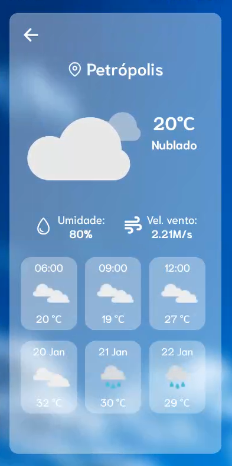

# WeatherFind 🌦️  

## 📜 Descrição  
Este projeto é um aplicativo de clima desenvolvido com o intuito de revisar e aprender novos conceitos de desenvolvimento mobile, além de práticas como a consulta a APIs públicas, criação de rotas e utilização de hooks. Ele permite ao usuário buscar por diferentes cidades do Brasil e visualizar suas informações climáticas detalhadas, incluindo temperatura, umidade e previsões diárias. É uma ferramenta com design intuitivo e visualmente atraente, ideal para quem deseja acessar informações meteorológicas de maneira rápida e prática.  

## 🎨 Link do Figma  
[Design do projeto](https://www.figma.com/design/G8pycYw7Wk6C7EGdEkp2S9/WeatherFind?node-id=0-1&p=f&t=qOMrFiQbXDxxJR4w-0)  

## 📖 Funcionalidades  
- Pesquise por cidades de todo o Brasil.  
- Visualize a temperatura atual, descrição do clima, umidade e velocidade do vento.  
- Veja previsões de temperatura para o dia atual e médias para os próximos dias.  

## 🖼️ Prévia  
 

## 🛠️ Tecnologias Utilizadas  
- **React Native** com Expo  
- **TypeScript**  
- **AsyncStorage** para armazenamento local  
- **Lottie** para animações  
- **Axios** para requisições HTTP  

## 🌐 APIs Utilizadas  
- [OpenWeather API](https://openweathermap.org/api):&ensp;para obter dados climáticos.  
- [GeoNames API](https://www.geonames.org/):&ensp;para buscar nomes de cidades.  

## ⚠️ Importantes

- Devido a alguns problemas de compatibilidade, esse projeto foi feito utilizando a versão 51 do expo. Se ocorrer algum problema ao executar o aplicativo no expo go, siga as instruções e baixe o apk compatível com a versão.

- Para executar o projeto, você precisará [gerar uma API KEY](https://home.openweathermap.org/api_keys) após criar uma conta no site da OpenWeatherMap e também [criar um username](https://www.geonames.org/login) no site da GeoNames (isso é feito criando sua conta). Esses dados podem demorar cerca de 30 minutos para serem validados.

- A GeoNames API, utilizada para pegar dados de nomes das cidades brasileiras, não contém os nomes de todas as cidades. Por conta disso, alguns deles vão levar à tela de 404 - não encontrado.

- Ao consultar o clima de uma cidade, são exibidas informações abaixo sobre o clima nos próximos dias. Como a API utilizada apenas retorna dados de 3 em 3 horas, foi feita uma aproximação do valor diário, o que não é tão preciso quanto os dados de outros intervalos.


## 🚀 Como Executar o Projeto  

1. Clone o repositório:  
   ```bash  
   git clone https://github.com/AnaMotta223/weather-app.git  
   cd weather-app  
   ```  

2. Instale as dependências:  
   ```bash  
   npm install  
   ```  

3. Configure as variáveis de ambiente e username:  
   No arquivo app.json, adicione o seguinte trecho, substituindo o valor após os pontos pela sua API KEY gerada:  
   ```json  
   "extra": {
      "API_KEY": "sua_api_key"
    },
   ```  
   No arquivo ServiceGetCities, na pasta utils -> services, substitua o username na linha 4 pelo gerado anteriormente:
    ```typescript
   const username = 'seu_username'; 
   ``` 

4. Inicie o projeto:  
   ```bash  
   npx expo start 
   ```  

5. Abra o aplicativo no seu dispositivo ou emulador utilizando o Expo Go.  

---